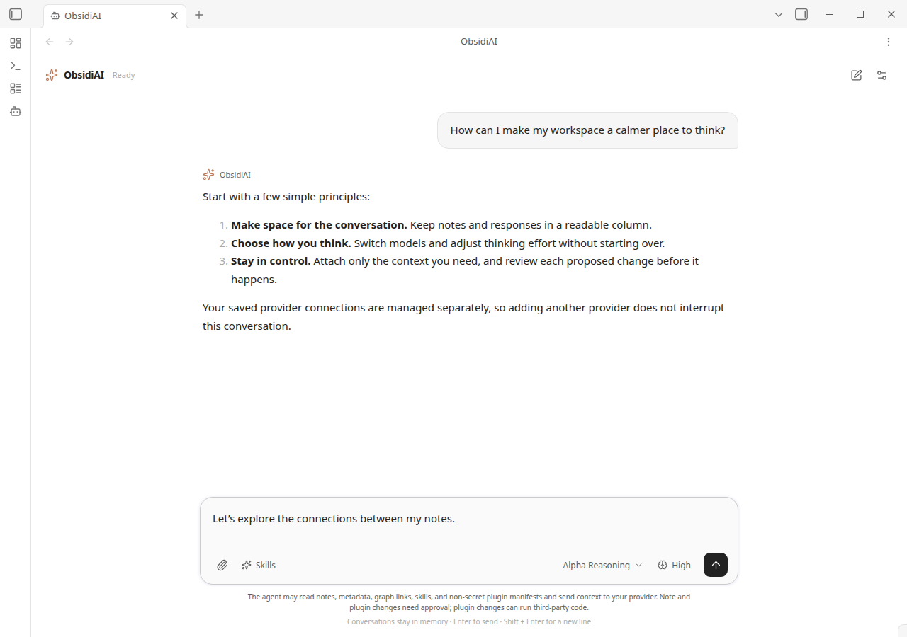
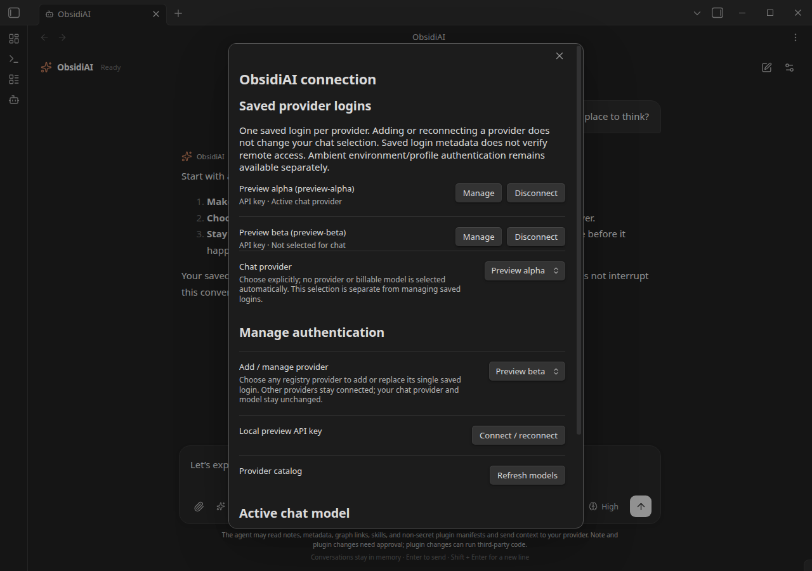

<p align="center">
  
</p>

<h1 align="center">ObsidiAI</h1>

<p align="center">
  <a href="https://github.com/KNN-07/ObsidiAI/actions/workflows/ci.yml"></a>
  <a href="https://github.com/KNN-07/ObsidiAI/releases/latest"></a>
</p>

<p align="center"><strong>Your vault. Your models. Your approval.</strong></p>

An AI agent in a native Obsidian tab. Ask questions across your notes, explore the connections between ideas, and turn a conversation into reviewed changes—without leaving your workspace.

Powered by [pi](https://github.com/earendil-works/pi), ObsidiAI runs inside the desktop plugin. No separate agent installation, terminal session, or embedded web app.

> **Early preview · Desktop only.** Behavioral tests and isolated bundle checks cover the implementation. The redesigned native UI has been checked in a disposable vault on Obsidian 1.13.7, using a local scripted provider—not a remote model. Successful remote-provider login and actual native plugin-manager lifecycle effects remain unverified. Start in a disposable vault, not your only copy of important notes.



*Actual Obsidian 1.13.7, in a disposable vault with local scripted providers and sample conversation content. No private notes or credentials are shown. Screenshots depict the source build, not the older 0.1.0 release.*

## From question to approved change

1. **Bring context.** Attach a note, capture an editor selection, or ask the agent to find relevant notes. Attachments stay in the draft until you send.
2. **Work with your vault.** The agent can search notes, inspect metadata, follow links, and load reusable skill instructions.
3. **Review the proposal.** Note edits show a before/after diff. Plugin changes have their own approval dialog and code-execution warnings.
4. **Decide what happens.** Approve or reject each change. If a note changes while you review it, the agent must read it again and request a new approval.

Try prompts like:

> “Find notes tagged #project with status active and summarize the next steps.”
>
> “Which notes link to Projects/Alpha.md? Show the shortest link path to Research/Overview.md.”
>
> “Read Projects/Alpha.md and change Status: draft to Status: reviewed.”

## What you can do

| Capability | How it helps |
| --- | --- |
| **Chat in your workspace** | A centered conversation column, streaming responses, and a rounded composer with note attachments, Skills, and model selection. Tool details collapse; approval and outcome badges stay visible. |
| **Keep multiple providers connected** | Manage one saved login per provider in Settings. Add, reconnect, or disconnect each independently; search available models across providers directly from chat. |
| **Choose thinking effort** | Select only the levels supported by the current model. Your preference is saved; the effective level adapts when you switch models. Higher effort may use more tokens and time. |
| **Search and edit notes** | Literal text search, bounded note reads, and individually approved Markdown edits or new notes. |
| **Explore your knowledge graph** | Query backlinks, outlinks, neighborhoods, shortest paths, unresolved links, and orphan notes using Obsidian's native cache. |
| **Query structured information** | Filter by folder, exact tags, and frontmatter properties; inspect headings, tasks, links, and file metadata. |
| **Reuse skills** | Keep instruction-only skills in your vault and choose them from the Skills picker or with `/skill:name`. |
| **Manage community plugins** | Browse the official catalog and propose install, update, enable, disable, or uninstall operations—with separate approval for each change. |

Provider availability is not a promise of account access. Subscription eligibility, provider policy, credentials, and network conditions still apply. Graph and metadata results identify partial or provisional cache state rather than treating it as definitive vault truth.

### Conversation layout

The source build uses a Claude-inspired arrangement with restrained, shadcn-style controls, implemented entirely with native Obsidian components. No embedded web app or additional UI framework.

- **Start in the center.** Suggested prompts fill the draft without sending it. Provider setup remains visible until a model is ready.
- **Keep actions with the draft.** The paperclip, Skills picker, model selector, thinking-effort picker, and Send/Stop controls sit inside the composer. Selected context appears as removable chips.
- **Read without clutter.** User messages align right; assistant responses use a readable column capped at 760px. Expand a tool card for its result and note links. Errors expand automatically; code-execution warnings and partial-result notices remain visible when collapsed.
- **Use any pane width.** The layout adapts to narrow split panes and Obsidian's light/dark themes. Enter sends; Shift+Enter adds a line. Scrolling upward pauses automatic following; **Jump to latest** resumes it.

The redesigned interface, multi-provider login list, and thinking-effort selector are in the source build; the published 0.1.0 ZIP is unchanged.

## Get started

### Requirements

- **Obsidian desktop 1.11.4 or newer.** Mobile is not supported.
- **Embedded Node 22.19.0 or newer.** If ObsidiAI reports an older runtime, update the Obsidian desktop installer; an in-app update alone may not update Node.
- **Node 22.19.0+ and npm** on your development machine to build from source.
- A provider account/API key, or an ambient authentication method supported by your chosen provider, to send model requests.

### Install a release

Download **`obsidiai-<version>.zip`** from the [latest GitHub release](https://github.com/KNN-07/ObsidiAI/releases/latest). This is the ready-to-install plugin—not GitHub's automatic “Source code (zip)” archive. No local build or Node installation is needed; Obsidian's embedded Node requirement still applies.

Extract the ZIP into a **disposable test vault's** `.obsidian/plugins/` directory. It contains an `obsidiai` folder, giving you this layout:

```text
<test-vault>/.obsidian/plugins/obsidiai/
  main.js
  manifest.json
  styles.css
```

Alternatively, download the three individual assets—`main.js`, `manifest.json`, and `styles.css`—and put them in that folder. They remain available for Obsidian's plugin installer.

Application dependencies are bundled into `main.js`; do not copy `node_modules`.

Open the test vault in Obsidian, enable community plugins if needed, and enable **ObsidiAI**. You may need to reload Obsidian after copying the files.

### Build from source

If you want to develop or inspect a build yourself:

```sh
git clone https://github.com/KNN-07/ObsidiAI.git
cd ObsidiAI
npm ci
npm run build
```

Then install the three generated/root files using the same steps above. `main.js` is generated and not tracked in Git.

### Connect and start a conversation

1. Open **Settings → ObsidiAI**.
2. Under **Add / manage provider**, choose a provider and connect using one of its advertised authentication methods. Repeat for additional providers; each keeps its own login. Ambient-only providers show setup guidance instead of a login button.
3. Inspect **Saved provider logins** to manage or disconnect individual providers. Adding a login does not select a billable model or change the current chat selection.
4. Run **ObsidiAI: Open agent tab** from the command palette, or use the bot ribbon icon.
5. Click the model control inside the composer and search across available providers and models. Use **Refresh models** in Settings when a dynamic catalog needs updating.
6. Use the brain-icon **thinking effort** control to choose a supported level. It is disabled when the model has no adjustable effort. Model, effort, and authentication changes are locked during an active run.
7. Write a prompt. Use **Attach note** or **Skills** when you want to add explicit context.

You can also select text in an editor and run **ObsidiAI: Ask agent about selection**. This adds a draft attachment; it does not send anything automatically.

Switching providers preserves the conversation; your next request sends its context to the newly selected provider. This is a multi-provider list, not multiple accounts for the same provider. Reconnecting replaces only that provider's saved login. Disconnect removes its plugin-stored login, not ambient environment/profile credentials.

<details>
<summary>Saved provider logins in the native settings dialog</summary>



*Local preview providers demonstrate the interface; this is not evidence of remote account access.*

</details>

## Make repeatable workflows with skills

Skills are Markdown instructions, not executable extensions. By default, ObsidiAI discovers them under the visible `Skills` folder:

```text
Skills/
  review/
    SKILL.md
    references/
      checklist.md
```

A minimal `SKILL.md`:

```markdown
---
name: link-review
description: Review a note's links and suggest useful connections.
---
Read the selected note, inspect its outgoing links and backlinks,
and suggest relevant connections. Explain proposed edits before
requesting approval. Use references/checklist.md when needed.
```

Choose **Skills** in the agent tab, run **ObsidiAI: Choose skill**, or begin a message with:

```text
/skill:link-review Focus on Projects/Alpha.md
```

Selecting a skill adds a removable draft chip. Skill resources are restricted to plain-text files inside the activated skill's directory. Set `disable-model-invocation: true` in frontmatter to require explicit user selection. An `allowed-tools` declaration is descriptive only: it cannot grant execution permissions or bypass approvals.

## Privacy and control

- **Context goes to your selected provider.** After you send a prompt, the agent can read permitted notes, metadata, graph data, skills, and non-secret plugin manifests and include returned context in model requests. Attaching a note is not a limit on the other notes it may inspect during that run.
- **No background vault uploads or embeddings.** There is no second persisted search index.
- **Conversation history stays in memory.** Transcripts, attachment snapshots, and proposals are not saved to plugin settings. Closing the tab retains the settled conversation for reopening during the loaded plugin's lifetime; New conversation resets it.
- **Plugin credentials use Obsidian SecretStorage.** Non-secret preferences are saved separately. ObsidiAI does not automatically import pi CLI credentials from `~/.pi/agent/auth.json`; provider-supported ambient environment/profile authentication remains available.
- **Changes require individual approval.** There is no approve-all switch. Edits are bound to the reviewed content and checked for conflicts with both saved notes and open editor buffers.
- **Stop is not undo.** It prevents pending approvals and subsequent work, but an atomic write or native plugin operation already in progress may finish. Applied changes stay applied.

### Community-plugin safety

Community plugins are **unsandboxed third-party code**. Native installation, updates, and enabling can execute code with Obsidian privileges. A registry listing is not a security audit, and ObsidiAI does not verify downloaded source code or checksums.

Plugin management uses an isolated, private Obsidian API. Unsupported capabilities fail explicitly; there is no direct-filesystem or CLI fallback. New installations target a disabled state, and enabling requires a separate approval. Native uninstall may remove the plugin's files **and saved settings**; no backup is created.

ObsidiAI's approval policy constrains its own tools. It is not a sandbox against other plugins already running in Obsidian.

## Development

```sh
npm run typecheck                         # Check source and tests
npm test                                  # Run the behavioral suite
npm test -- tests/vault-tools.test.ts      # Run a focused suite
npm run build                             # Typecheck and bundle for production
npm run check:release                     # Validate versions and built release assets
npm run dev                               # Watch and rebuild; does not launch Obsidian
```

The implementation uses TypeScript, native Obsidian components, pi Agent/Models, esbuild, and Vitest. See [Repository Guidelines](AGENTS.md) for architecture, code conventions, and safety invariants.

Verification to date includes deterministic real-Agent tool loops, approval/conflict/cancellation cases, credential serialization, graph/metadata queries, skill restrictions, and plugin lifecycle policy. Isolated bundle checks have exercised incremental local SSE and cancellation through the real OpenAI-compatible and Google adapters, OAuth start/cancel, and host-fetch isolation.

Those checks are **not** proof of native UI behavior, successful remote authentication, or actual native plugin installation/uninstallation. Keep native-host verification separate, use disposable vaults, and never include credentials or private note content in bug reports.

### CI and releases

GitHub Actions runs tests, typechecking, production builds, and release validation on pull requests and pushes to `main`, using **Node 22.19.0 and Node 24**. Successful runs retain the installable plugin artifact for seven days.

To prepare a release:

1. Keep `package.json`, `package-lock.json`, and `manifest.json` versions identical. Add the version-to-minimum-Obsidian mapping to `versions.json`.
2. Add reviewed notes at `.github/release-notes/<version>.md`.
3. Run `npm run build`, `npm test`, and `npm run check:release`. Commit and push the changes.
4. Push an annotated tag matching the manifest version exactly—such as `0.1.0`, **not** `v0.1.0`.

The Release workflow reruns the shared CI checks, downloads the tested artifact, and publishes both the three individual plugin assets and `obsidiai-<version>.zip` containing the ready-to-copy plugin folder. A draft is published only after asset upload succeeds. Published releases are not overwritten by the workflow; fix a failed draft by rerunning its workflow, or ship a new version for changes to an existing public release.

## Feedback

Found a problem or have a workflow in mind? [Open an issue](https://github.com/KNN-07/ObsidiAI/issues) with your Obsidian version, platform, steps to reproduce, and a sanitized example. For authentication issues, include the provider and safe error category—not tokens, keys, or raw response bodies.
